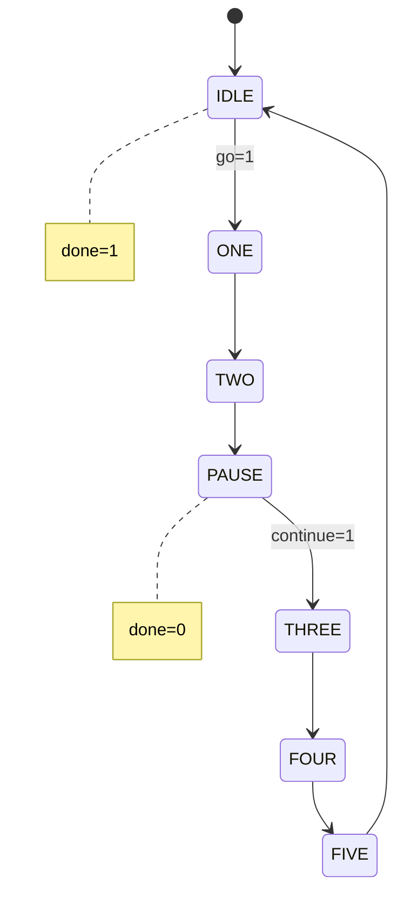

# StateMachine Specification
This is a human-machine co-created specificaiton for the stateMachine module.

## Filename
stateMachine.sv

## Inputs and Outputs
clock
resetn
    - Active low
go
    - Input
continue
    - Input
done
    - Output

### Description
- We are creating a statemachine.
- The machine should start in the IDLE state after reset.
    - The output signal done should be high.
- When "go" becomes logic high then transition ONE to TWO to PAUSE and the done signal goes low.
- Stay in PAUSE until the continue signal goes high then transition THREE to FOUR to FIVE then back to IDLE.
- Stay in IDLE until the go signal is given.
    - Because we are in the IDLE state the done output should be high.

## State Diagram

